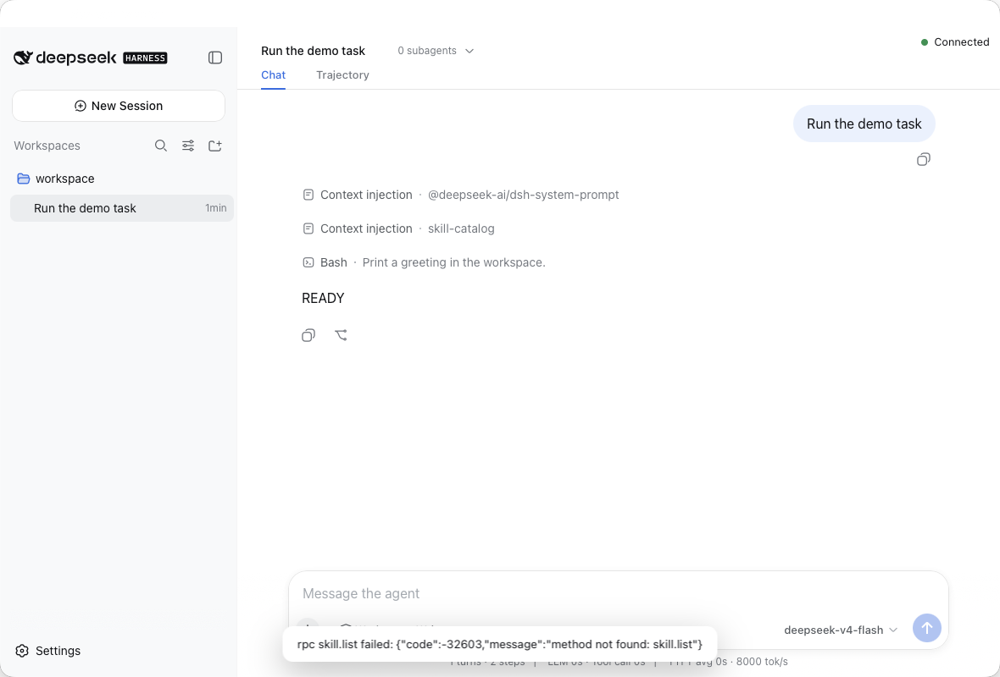

# DeepSeek Harness App

English | [中文](README.zh.md)

An open-source macOS desktop client built on top of [DeepSeek Harness](https://github.com/deepseek-ai/deepseek-harness), providing a native desktop experience for Harness sessions, tool calls, approvals, workspaces, and model interaction. Community-developed and unofficial: not affiliated with or endorsed by DeepSeek.



More views: [first-run onboarding](docs/assets/onboarding.png), [conversation](docs/assets/conversation.png), [approval](docs/assets/approval.png), [settings](docs/assets/settings.png).

## About

DeepSeek Harness App wraps the packaged DeepSeek Harness runtime in a Tauri desktop shell. The Rust host owns the runtime process, the macOS Keychain holds the API key, and the conversation UI is the upstream Harness client composed unchanged. Built on DeepSeek Harness by DeepSeek AI.

## Features

- First-run onboarding with a native workspace picker
- Sessions with streaming responses, tool calls, approvals, and questions
- Image attachments through paste, drop, or the native picker
- API key in the macOS Keychain; no plaintext credential storage
- English, Chinese, Italian, Spanish, French, German, and Brazilian Portuguese surfaces with a System language option
- Native menu, shortcuts, notifications, and About window

## Installation

1. Download the latest .dmg from the [Releases](https://github.com/Alexmen97/deepseek-harness-app/releases) page.
2. Open the DMG.
3. Drag Harness Desktop to Applications.
4. Launch the app.
5. Configure your DeepSeek API key.
6. Select a project.

No Node installation is required.

## Latest Public Preview

Public preview builds are available on the [Releases](https://github.com/Alexmen97/deepseek-harness-app/releases) page. Current public preview builds are NOT Apple-notarized: they are ad-hoc signed, so macOS may show a Gatekeeper warning on first launch.

1. Download the preview .dmg from the Releases page.
2. Open the DMG and drag Harness Desktop to Applications.
3. Attempt to launch the app.
4. If macOS blocks it, open System Settings → Privacy & Security and choose Open Anyway.

Do not disable Gatekeeper globally. Once Apple Developer ID notarized releases exist, this section will distinguish Stable and Preview builds.

## Requirements

- macOS on Apple Silicon
- A DeepSeek API key (or a compatible custom Base URL)

## Getting Started

See [docs/USER-GUIDE.md](docs/USER-GUIDE.md) for the first-run flow and [docs/TROUBLESHOOTING.md](docs/TROUBLESHOOTING.md) for help.

## Development

```sh
pnpm install
node scripts/build-exe-for-desktop.ts
cd apps/desktop && pnpm exec tauri build
```

See [docs/desktop/M1B-TESTING.md](docs/desktop/M1B-TESTING.md) for the test layers and [CONTRIBUTING.md](CONTRIBUTING.md) for the boundaries.

## Architecture

React (reused Harness UI) → DesktopApiClient → Tauri IPC → the Rust runtime manager → stdio JSON-RPC → the packaged Harness runtime. The full contract is in [docs/desktop/ARCHITECTURE.md](docs/desktop/ARCHITECTURE.md).

## Building

```sh
pnpm install
node scripts/build-exe-for-desktop.ts
cd apps/desktop && pnpm exec tauri build
node scripts/sign-desktop.mjs --mode adhoc-hardened
node scripts/make-desktop-dmg.mjs
```

Public releases are Developer ID signed, notarized, and stapled; see [docs/desktop/DISTRIBUTION.md](docs/desktop/DISTRIBUTION.md).

## Security

The API key lives in the macOS Keychain and is never read back by the frontend. The WebView loads only bundled content, external links open in the system browser, and the host IPC surface contains no generic exec or filesystem commands. Report vulnerabilities through private vulnerability reporting ([SECURITY.md](SECURITY.md)).

## Roadmap

See [ROADMAP.md](ROADMAP.md).

## Upstream

This repository is derived from [deepseek-ai/deepseek-harness](https://github.com/deepseek-ai/deepseek-harness) (MIT), pinned to the version recorded in [docs/project/upstream-base.json](docs/project/upstream-base.json). The upstream history is preserved; the desktop additions and the four upstream patches are listed in [docs/project/REPOSITORY-STRUCTURE.md](docs/project/REPOSITORY-STRUCTURE.md) and [docs/desktop/UPSTREAM-PATCHES.md](docs/desktop/UPSTREAM-PATCHES.md).

## Contributing

Pull requests are welcome. Read [CONTRIBUTING.md](CONTRIBUTING.md) and the [Code of Conduct](CODE_OF_CONDUCT.md).

## License

MIT. See [LICENSE](LICENSE) and [THIRD_PARTY_NOTICES.md](THIRD_PARTY_NOTICES.md).
